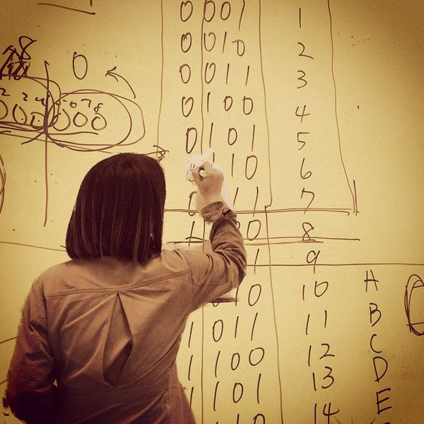

# Coed Algorithms at Noisebridge

We meet Sundays 2-4pm at Noisebridge.
All Programming languages, your native on preferred.
We love to use whiteboards for good, not evil!

The ultimate purpose is to turn job interview coding algorithms into something that is actually fun and beautiful. This is stuff we'd like to know in our everyday life.

* Main Wiki Page: [Coed Algorithm Group](https://noisebridge.net/wiki/(affiliated_with)_Women_Who_Code_Algorithms_Study_Group#Notes)
* Slack Channel https://noisebridge.slack.com/messages/algorithms/

